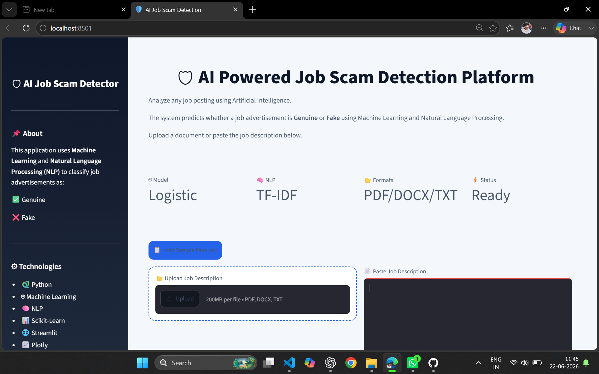
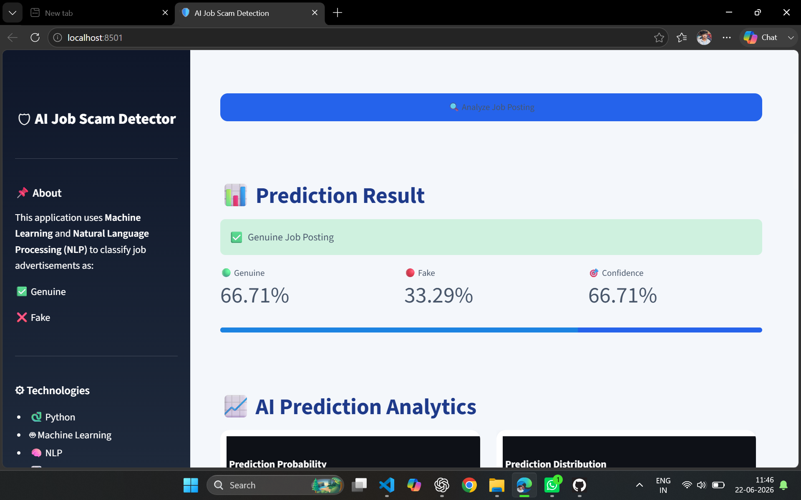
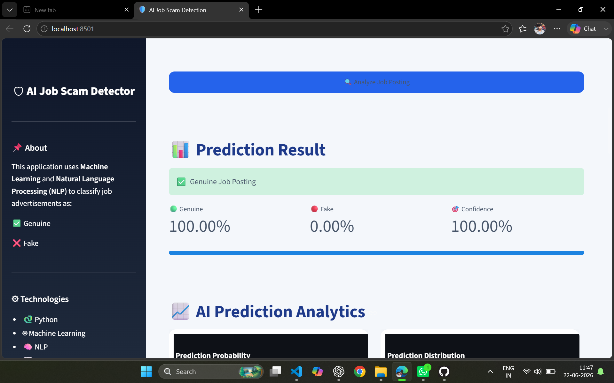
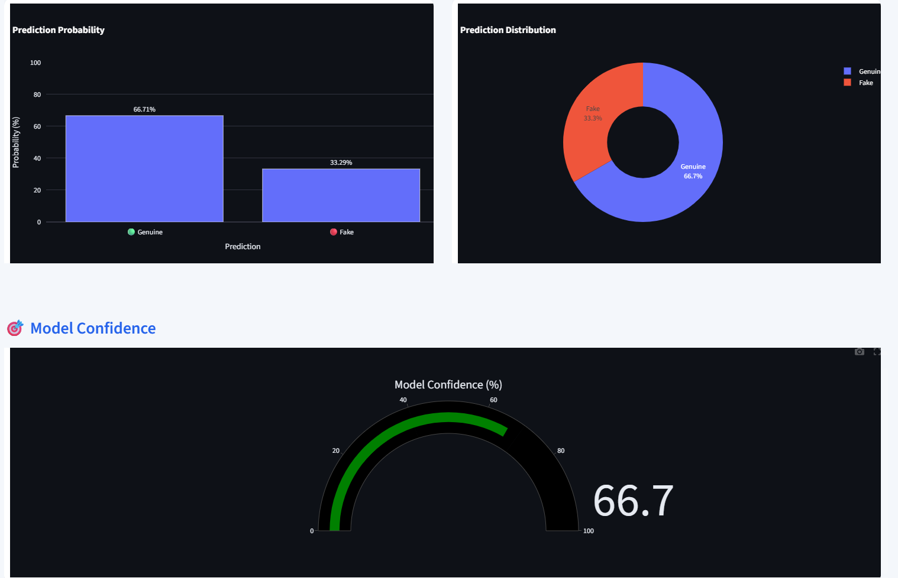

# 🛡️ AI-Powered Job Scam Detection Platform


An AI-powered web application that detects **fraudulent job postings** using **Machine Learning** and **Natural Language Processing (NLP)**. The application analyzes job descriptions and predicts whether a posting is **Genuine** or **Fraudulent**, helping job seekers identify potential scams before applying.

---

# 🌐 Live Demo

**🚀 Try the Application**

https://ai-job-scam-detection-sjappxmxsrjtqvh9amhvcr.streamlit.app/

---

# 📂 GitHub Repository

https://github.com/kummaranikhil/AI-Job-Scam-Detection

---

# 📖 Project Overview

Online recruitment scams have become increasingly common. Fraudulent recruiters often post fake job advertisements to steal money or personal information from applicants.

This project leverages **Machine Learning** and **Natural Language Processing (NLP)** to automatically analyze job descriptions and classify them as either:

* ✅ Genuine Job Posting
* 🚨 Fraudulent Job Posting

The application also provides prediction confidence, interactive visualizations, and suspicious keyword analysis through a modern Streamlit dashboard.

---

# ✨ Features

* 🤖 AI-powered Job Scam Detection
* 🧠 NLP-based Text Processing
* 📄 Upload PDF, DOCX, and TXT files
* ✍️ Manual Job Description Input
* 📋 Load Sample Fake Job
* 📊 Interactive Plotly Charts
* 🎯 Prediction Confidence Gauge
* 🚨 Risk Assessment
* 🔍 Suspicious Keyword Detection
* 📈 Probability Visualization
* 🌐 Live Web Application using Streamlit

---

# 🛠️ Tech Stack

### Programming Language

* Python

### Machine Learning

* Scikit-learn
* Logistic Regression
* TF-IDF Vectorization

### Data Analysis

* Pandas
* NumPy

### Data Visualization

* Plotly
* Matplotlib

### Web Framework

* Streamlit

### Document Processing

* pdfplumber
* python-docx
* ReportLab

---

# 🧠 Machine Learning Workflow

```text
Job Description
        │
        ▼
Text Preprocessing
        │
        ▼
TF-IDF Vectorization
        │
        ▼
Logistic Regression Model
        │
        ▼
Prediction
        │
        ▼
Confidence Score
        │
        ▼
Risk Analysis
        │
        ▼
Interactive Dashboard
```

---

# 📊 Dataset

**Source:** Kaggle

**Dataset:** Fake Job Postings Dataset

The dataset contains thousands of real and fraudulent job advertisements with information such as:

* Job Title
* Company Profile
* Job Description
* Requirements
* Benefits
* Employment Type
* Industry
* Fraudulent Label

---

# 📂 Project Structure

```text
AI-Job-Scam-Detection/
│
├── app.py
├── config.py
├── requirements.txt
├── README.md
│
├── assets/
│   └── style.css
│
├── models/
│   ├── job_scam_model.pkl
│   ├── tfidf_vectorizer.pkl
│   └── feature_columns.pkl
│
├── screenshots/
│   ├── homepage.png
│   ├── fake_prediction.png
│   ├── genuine_prediction.png
│   └── analytics.png
│
├── src/
│   ├── predict.py
│   ├── preprocessing.py
│   ├── explain.py
│   ├── charts.py
│   ├── file_handler.py
│   ├── logger.py
│   └── report_generator.py
```

---

# 📸 Application Screenshots

## 🏠 Home Page

Users can upload job descriptions, paste text manually, or load a sample job posting.



---

## 🚨 Fraudulent Job Detection

The AI predicts fraudulent job postings and displays confidence, risk level, and suspicious indicators.



---

## ✅ Genuine Job Detection

The model correctly identifies legitimate job postings and provides prediction confidence.



---

## 📊 Analytics Dashboard

Interactive visualizations generated using Plotly.

Includes:

* Prediction Probability Bar Chart
* Probability Distribution Pie Chart
* Model Confidence Gauge



---

# 🚀 Installation

Clone the repository

```bash
git clone https://github.com/kummaranikhil/AI-Job-Scam-Detection.git
```

Move into the project directory

```bash
cd AI-Job-Scam-Detection
```

Install dependencies

```bash
pip install -r requirements.txt
```

Run the application

```bash
streamlit run app.py
```

---

# 💡 Future Improvements

* 🤖 BERT / DistilBERT based classification
* 🧠 Explainable AI using SHAP
* 🌐 Company Website Verification
* 📧 Email Domain Validation
* 🔗 URL Reputation Analysis
* 🌙 Dark Mode
* 👤 User Authentication
* 📊 Admin Analytics Dashboard
* 🔌 REST API Integration
* ☁️ Docker & Cloud Deployment

---

# 👨‍💻 About the Developer

**Kummara Nikhil**

🎓 B.Tech – Computer Science & Engineering (AI & ML)

💡 Aspiring AI Engineer | Machine Learning | Data Science | NLP Enthusiast

**GitHub**

https://github.com/kummaranikhil

---

# ⭐ Support

If you found this project helpful, please consider giving it a **⭐ Star** on GitHub.

Your support motivates future improvements and helps others discover the project.

---

# 📜 License

This project is developed for **educational, research, and portfolio purposes**.
